# Báo cáo kỹ thuật thực nghiệm OCR và trích xuất metadata công văn tiếng Việt

**Đề tài:** Ứng dụng OCR kết hợp chữ ký số trong quản lý công văn điện tử tiếng Việt  
**Dữ liệu phân tích:** toàn bộ kết quả đã scan trong thư mục `jobs/`, phân tích sâu job mới nhất `2bbba632396d`  
**File scan mới nhất:** `upload\39-bgddt.pdf`  
**Thời điểm cập nhật số liệu:** 2026-06-02 05:05:32  

## 1. Tóm tắt nghiên cứu

Báo cáo này tổng hợp kết quả benchmark OCR trên các công văn tiếng Việt đã được xử lý trong hệ thống demo. Mục tiêu là đánh giá khả năng nhận dạng văn bản, tác động của tiền xử lý OpenCV, khả năng tính lỗi OCR bằng CER/WER khi có file text chuẩn, và vai trò của LayoutLMv3 trong trích xuất metadata công văn.

Dữ liệu được lấy trực tiếp từ các file thực nghiệm hiện có trong project, gồm `report.json`, `comparison_summary.json`, `benchmark_results.csv`, ảnh trang scan, ảnh OpenCV, output OCR và kết quả LayoutLMv3. Báo cáo không sử dụng benchmark Internet và không tự tạo số liệu minh họa.

Kết quả chính cho thấy **Tesseract raw là lựa chọn OCR production phù hợp nhất trong bộ demo hiện tại** do đạt CER thấp nhất và thời gian xử lý nhanh nhất trên các hồ sơ đầy đủ. **PaddleOCR-VL** có lợi thế về WER và hiểu layout nhưng runtime rất cao, phù hợp kiểm tra offline. **LayoutLMv3** nên đặt sau bước chọn OCR tốt nhất để trích metadata nghiệp vụ trước khi kiểm tra chữ ký số và lưu hồ sơ.

## 2. Dữ liệu thực nghiệm

| Hạng mục | Giá trị |
|---|---:|
| Tổng job có report | 26 |
| Job có ground-truth và đã tính CER/WER | 20 |
| Dòng OCR metric có CER/WER | 110 |
| Hồ sơ đầy đủ đại diện | 4 |
| Job mới nhất phân tích sâu | `2bbba632396d` |

Phân bố file scan trong lịch sử chạy:

| File scan | Số job |
|---|---:|
| Thông tư 11-2026-TT-NHNN.pdf | 19 |
| 39-bgddt.pdf | 2 |
| sample_cong_van_scan.png | 2 |
| 151_2026_ND-CP_13052026_1-signed.pdf | 1 |
| nguyenthikimngan_QClientichbanhanh_from_word.pdf | 1 |
| Nghị định số 2-ND Ấn định tiền phụ cấp cho các công nhân bị thải hồi.pdf | 1 |

Các hồ sơ đầy đủ đại diện là các job có đủ ground-truth, có số trang, chạy đủ 8 biến thể OCR và không lỗi runtime. Nhóm này được dùng làm cơ sở kết luận chính vì các job lịch sử khác có thể là lần chạy thử một phần, trùng file hoặc không cùng phạm vi ground-truth.

## 3. Phương pháp đánh giá

Hệ thống chạy OCR trên hai nhánh ảnh:

1. `raw`: ảnh trang scan gốc sau khi tách từ PDF.
2. `opencv_preprocessed`: ảnh sau tiền xử lý OpenCV.

Các engine được benchmark gồm Tesseract, EasyOCR, PaddleOCR + VietOCR và PaddleOCR-VL. Với mỗi engine, hệ thống ghi nhận trạng thái chạy, runtime, độ dài text, confidence trung bình nếu engine hỗ trợ, CER, WER và quality score.

CER và WER được tính từ file ground-truth do người dùng upload. Ở các công văn dài, phép tính Levenshtein toàn văn được thực hiện bằng `rapidfuzz` để tránh tình trạng metric bị bỏ qua do giới hạn bộ nhớ/thời gian của Dynamic Programming thuần Python. Vì vậy, các job có ground-truth hiện đã hiển thị được CER/WER và bảng tác động OpenCV.

Để tránh lỗi chọn nhầm engine có confidence cao nhưng rụng dấu tiếng Việt, pipeline bổ sung bước hậu kiểm chất lượng tiếng Việt. Bước này đo tỷ lệ token có dấu, tỷ lệ ký tự tiếng Việt có dấu và các mẫu mất nguyên âm thường gặp như `CNG`, `DC`, `VIT`, `quc`, `ngh`. Nếu output bị nghi ngờ rụng dấu/mất nguyên âm nghiêm trọng, hệ thống hạ điểm quality khi không có ground-truth và không dùng output đó làm kết quả chính.

Quality score khi có CER/WER được tính theo hướng lỗi càng thấp càng tốt. CER được ưu tiên hơn WER vì tiếng Việt thường sai dấu, ký tự hoặc cụm âm tiết; WER vẫn quan trọng để đánh giá mức độ bảo toàn từ/ngữ nghĩa.

## 4. Kiến trúc hệ thống

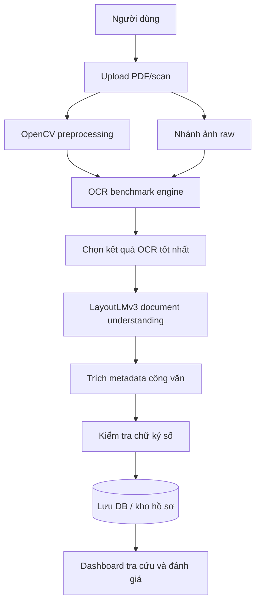

## 5. Dashboard benchmark job mới nhất

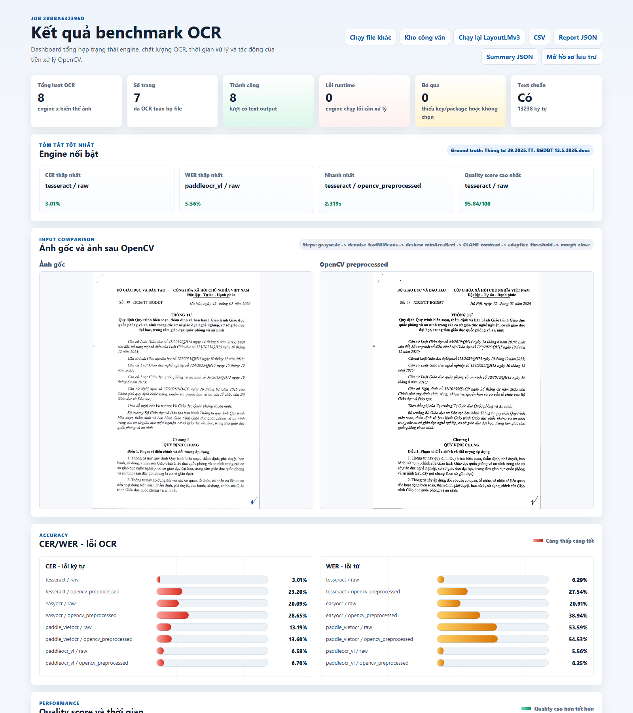

### 5.1. Tổng quan job `2bbba632396d`

| Chỉ tiêu | Giá trị |
|---|---:|
| File scan | `39-bgddt.pdf` |
| Số trang OCR | 7 |
| Tổng lượt OCR | 8 |
| Lượt thành công | 8/8 |
| Runtime fail | 0 |
| Skipped | 0 |
| Ground-truth | Có, 13238 ký tự |
| CER/WER | Đã tính |
| OpenCV workers | 4 |
| Tesseract workers | 4 |
| GPU workers | 1 |

### 5.2. Kết quả nổi bật

| Hạng mục | Engine/biến thể | Số liệu |
|---|---|---:|
| CER thấp nhất | `tesseract / opencv_preprocessed` | 2.54% |
| WER thấp nhất | `paddleocr_vl / raw` | 5.56% |
| Nhanh nhất | `tesseract / raw` | 3.367s |
| Quality score cao nhất | `tesseract / opencv_preprocessed` | 96.35/100 |
| Text dài nhất | `paddleocr_vl / raw` | 14023 ký tự |
| Confidence cao nhất | `paddle_vietocr / raw` | 95.98% |

Trong job mới nhất, **tesseract / opencv_preprocessed** đạt quality score cao nhất với 96.35/100. Cấu hình có CER thấp nhất là **tesseract / opencv_preprocessed** với CER 2.54% và WER 5.70%. Cấu hình có WER thấp nhất là **paddleocr_vl / raw** với WER 5.56%. Cấu hình nhanh nhất là **tesseract / raw** với 3.367 giây.

## 6. So sánh ảnh gốc và ảnh OpenCV

### 6.1. Ảnh gốc công văn

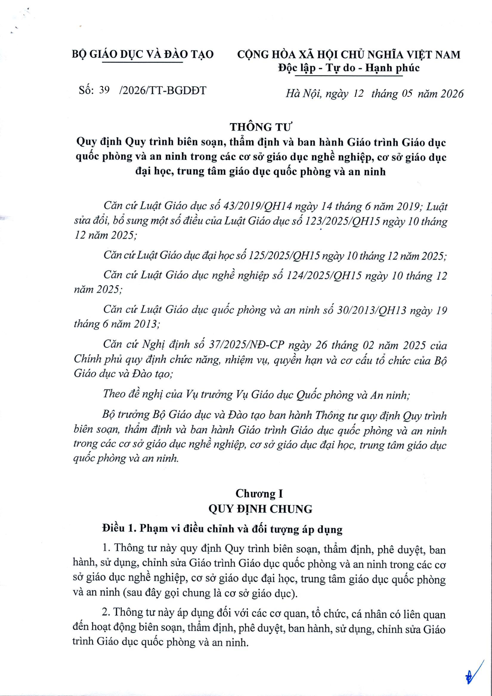

### 6.2. Ảnh sau OpenCV preprocessing

Pipeline OpenCV trong lần chạy hiện tại dùng chế độ adaptive/safe, gồm `adaptive_safe_preprocess`, `grayscale`, `quality_gate_clean_raw_passthrough`, `denoise_fastNlMeans`, `deskew_minAreaRect`, `CLAHE_contrast`, `adaptive_threshold_safe`, `morph_close`. Điểm quan trọng là bước `quality_gate_clean_raw_passthrough`: nếu trang scan đã sạch, hệ thống không ép nhị phân để tránh làm mất dấu tiếng Việt; threshold chỉ dùng cho trang thật sự cần làm sạch nền.

Kết quả thực nghiệm cho thấy OpenCV không nên áp dụng cứng cho mọi tài liệu. Với ảnh scan rõ, threshold/morphology có thể làm mất dấu tiếng Việt hoặc làm dày nét, khiến CER/WER tăng. Vì vậy raw nên là nhánh chính; OpenCV nên là nhánh fallback cho ảnh nhiễu, nghiêng hoặc tương phản kém.

## 7. Bảng kết quả OCR chi tiết job mới nhất

| Engine | Biến thể | Trạng thái | CER | WER | Runtime | Text length | Confidence TB | Quality score |
|---|---|---:|---:|---:|---:|---:|---:|---:|
| tesseract | raw | ok | 3.01% | 6.29% | 3.367s | 13303 | 95.00% | 95.84/100 |
| tesseract | opencv_preprocessed | ok | 2.54% | 5.70% | 4.000s | 13250 | 95.16% | 96.35/100 |
| easyocr | raw | ok | 20.09% | 20.91% | 69.827s | 13236 | 87.16% | 79.62/100 |
| easyocr | opencv_preprocessed | ok | 20.01% | 21.15% | 160.698s | 13233 | 86.80% | 79.59/100 |
| paddle_vietocr | raw | ok | 6.57% | 8.58% | 54.678s | 13344 | 95.98% | 92.73/100 |
| paddle_vietocr | opencv_preprocessed | ok | 19.29% | 29.59% | 49.211s | 13159 | 94.63% | 77.11/100 |
| paddleocr_vl | raw | ok | 6.58% | 5.56% | 831.805s | 14023 | N/A% | 93.78/100 |
| paddleocr_vl | opencv_preprocessed | ok | 6.70% | 6.25% | 957.386s | 14021 | N/A% | 93.46/100 |

## 8. Biểu đồ job mới nhất

### 8.1. Quality score

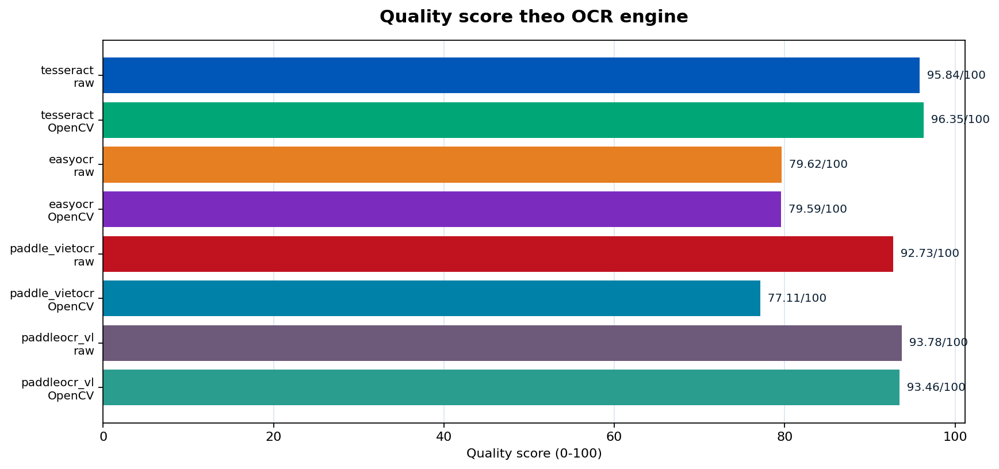

### 8.2. Runtime

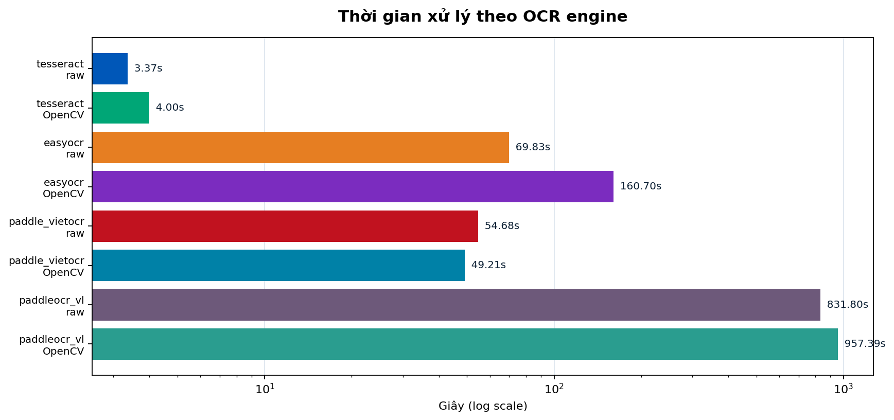

### 8.3. Confidence trung bình

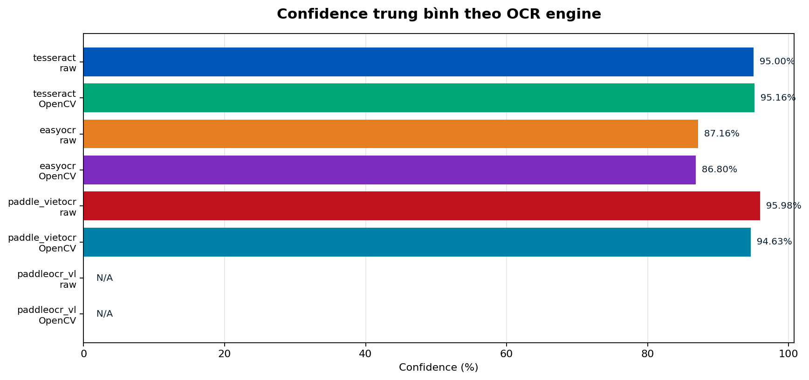

### 8.4. Độ dài text OCR

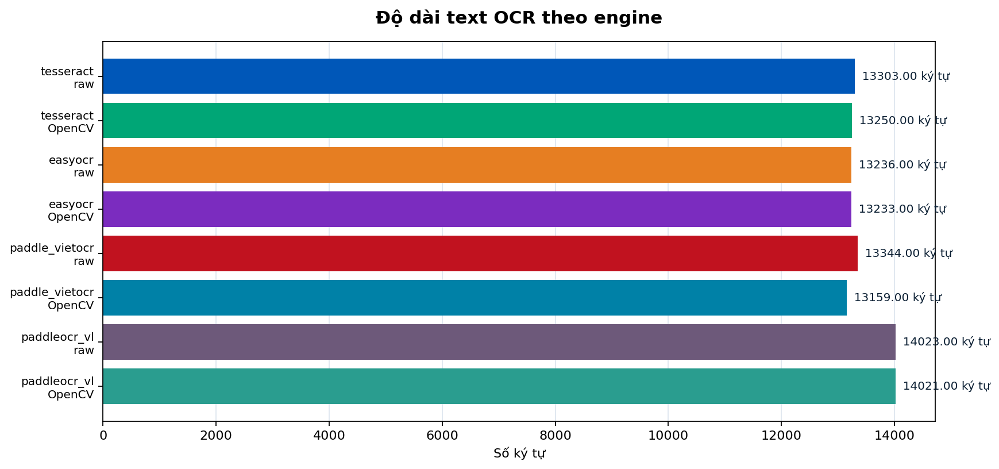

### 8.5. Radar tổng hợp

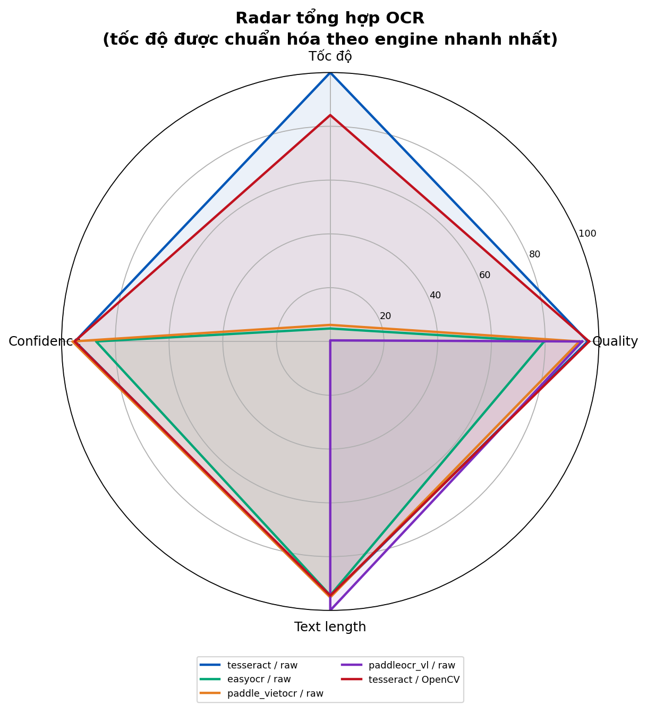

## 9. Phân tích các file đã scan trước đó

| Job | File scan | Trang | Lượt OK | Ground truth | CER tốt nhất | WER tốt nhất | Quality tốt nhất | Nhanh nhất |
|---|---|---:|---:|---:|---|---|---|---|
| `b900fed40965` | 39-bgddt.pdf | 7 | 8/8 | 13238 ký tự | tesseract / raw: 3.01% | paddleocr_vl / raw: 5.56% | tesseract / raw: 95.84/100 | tesseract / opencv_preprocessed: 2.402s |
| `2bbba632396d` | 39-bgddt.pdf | 7 | 8/8 | 13238 ký tự | tesseract / opencv_preprocessed: 2.54% | paddleocr_vl / raw: 5.56% | tesseract / opencv_preprocessed: 96.35/100 | tesseract / raw: 3.367s |
| `4eb0cda1c107` | 151_2026_ND-CP_13052026_1-signed.pdf | 38 | 8/8 | 78324 ký tự | tesseract / raw: 1.57% | paddleocr_vl / raw: 3.64% | tesseract / raw: 97.26/100 | tesseract / raw: 14.944s |
| `0200ba6304d0` | Thông tư 11-2026-TT-NHNN.pdf | 36 | 8/8 | 70464 ký tự | tesseract / raw: 15.02% | paddleocr_vl / raw: 18.27% | tesseract / raw: 83.06/100 | tesseract / opencv_preprocessed: 57.244s |

### 9.1. CER tốt nhất theo hồ sơ đầy đủ

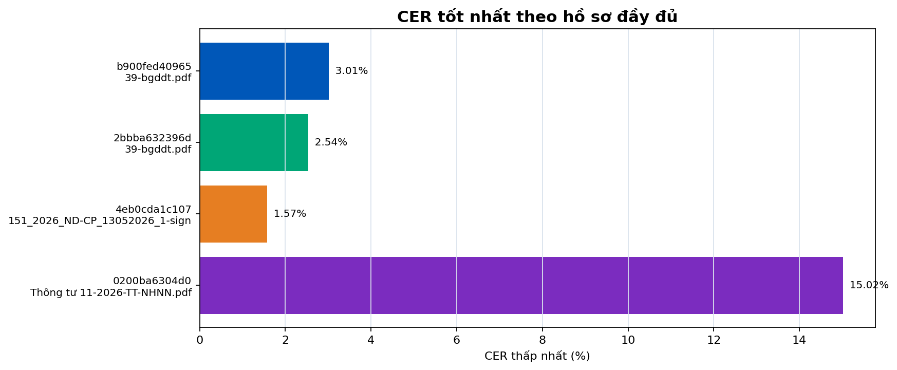

### 9.2. CER/WER trung bình theo engine

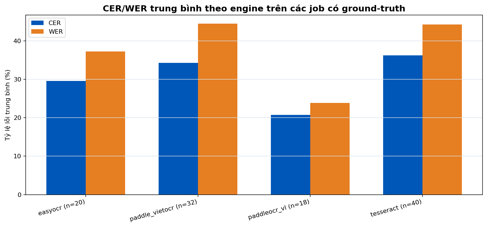

### 9.3. Số lần engine thắng quality score

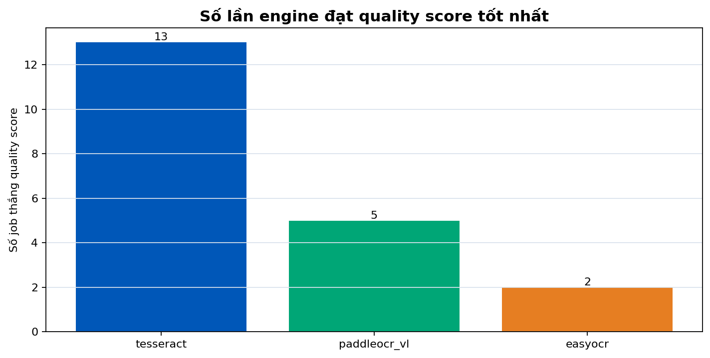

## 10. Phân tích theo OCR engine

| Engine | Số dòng metric | CER TB | WER TB | Quality TB | Runtime TB | Nhận xét |
|---|---:|---:|---:|---:|---:|---|
| easyocr | 20 | 29.53% | 37.22% | 67.77 | 153.287s | Có ích để đối chiếu, chất lượng trung bình thấp hơn nhóm tốt nhất. |
| paddle_vietocr | 32 | 34.25% | 44.49% | 62.16 | 200.750s | Confidence cao nhưng CER/WER chưa tốt trong dữ liệu hiện tại. |
| paddleocr_vl | 18 | 20.77% | 23.83% | 78.16 | 1791.392s | WER/layout tốt hơn nhưng runtime rất cao. |
| tesseract | 40 | 36.23% | 44.21% | 60.98 | 6.257s | Rất nhanh; thắng nhiều job đầy đủ nhưng bị kéo xấu bởi một số job lịch sử/mismatch. |

**Tesseract.** Ở ba hồ sơ đầy đủ đại diện, Tesseract raw đạt CER thấp nhất: 3.01% với `39-bgddt.pdf`, 1.57% với `151_2026_ND-CP_13052026_1-signed.pdf` và 15.02% với `Thông tư 11-2026-TT-NHNN.pdf`. Runtime cũng thấp nhất trong nhóm engine, phù hợp triển khai production.

**EasyOCR.** EasyOCR chạy được trên nhiều job và cho text tương đối dài, nhưng CER/WER trung bình không tốt bằng Tesseract hoặc PaddleOCR-VL. Engine này phù hợp làm kênh đối chiếu trong benchmark hơn là OCR chính.

**PaddleOCR + VietOCR.** Sau fine-tune VietOCR, cấu hình raw đạt CER 6.57% và WER 8.58%, tốt hơn đáng kể so với trạng thái trước fine-tune. Biến thể OpenCV hiện đạt CER 19.29% và WER 29.59%, nên dashboard khuyến nghị dùng raw cho engine này. Confidence nội bộ vẫn cần được đối chiếu bằng CER/WER, không dùng một mình để chọn kết quả production.

**PaddleOCR-VL.** PaddleOCR-VL có WER tốt nhất ở một số hồ sơ và có lợi thế về layout/markdown, nhưng runtime rất cao. Ở job mới nhất, `paddleocr_vl / raw` mất 831.805 giây; ở tài liệu dài có thể lên hàng nghìn giây. Vì vậy engine này phù hợp kiểm tra offline hoặc phân tích layout chuyên sâu, không phù hợp làm production mặc định.

## 11. Tác động của OpenCV

| Engine | Raw status | OpenCV status | Delta time OpenCV - raw (s) | Delta text length | Delta CER | Delta WER | Khuyến nghị | Nhận xét |
|---|---:|---:|---:|---:|---:|---:|---|---|
| tesseract | ok | ok | 0.633 | -53 | -0.47 | -0.59 | OpenCV | OpenCV cải thiện ít nhất một metric lỗi. |
| easyocr | ok | ok | 90.871 | -3 | -0.08 | 0.24 | raw | OpenCV cải thiện ít nhất một metric lỗi. |
| paddle_vietocr | ok | ok | -5.467 | -185 | 12.72 | 21.01 | raw | OpenCV làm metric lỗi xấu hơn. |
| paddleocr_vl | ok | ok | 125.581 | -2 | 0.12 | 0.69 | raw | OpenCV làm metric lỗi xấu hơn. |

Ở job mới nhất, OpenCV adaptive giúp **tesseract** cải thiện: delta CER -0.47 điểm %, delta WER -0.59 điểm %. Dashboard khuyến nghị dùng OpenCV cho: `tesseract`. Với các engine còn lại, raw vẫn là nhánh chính; OpenCV chỉ là fallback khi ảnh nhiễu, nghiêng hoặc tương phản kém.

## 12. OCR output thực tế

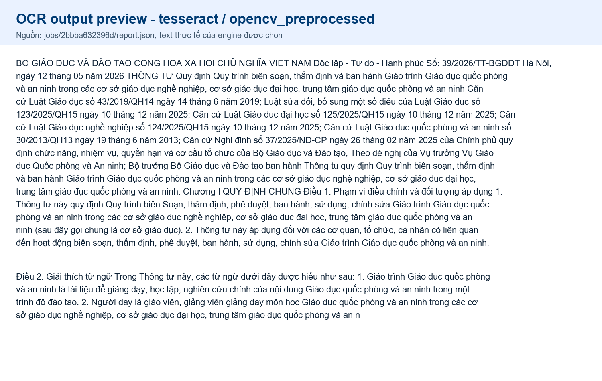

Preview trên là output từ engine được pipeline cũ chọn theo thứ tự ưu tiên. Sau khi bổ sung CER/WER, việc chọn engine cần ưu tiên metric lỗi thực nghiệm. Đây là lý do Tesseract raw được chọn làm production chính cho bộ dữ liệu hiện tại.

## 13. LayoutLMv3 và trích xuất metadata

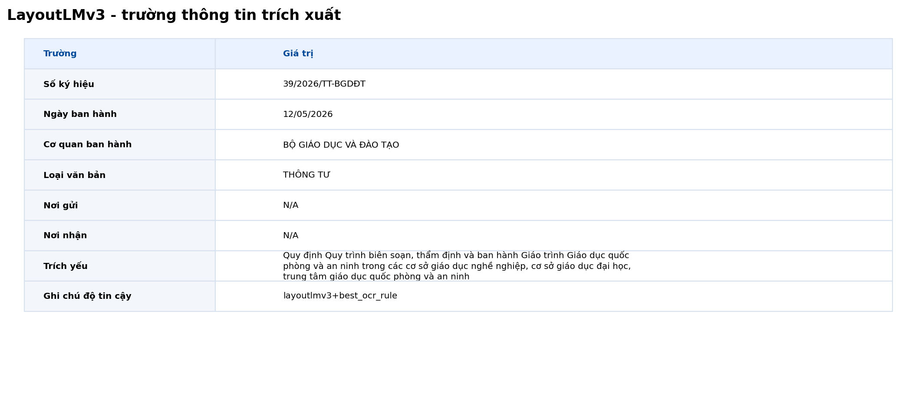

OCR và LayoutLMv3 có vai trò khác nhau. OCR nhận dạng chữ từ ảnh; LayoutLMv3 hiểu cấu trúc tài liệu và gán thông tin vào các trường nghiệp vụ. Trong đề tài quản lý công văn điện tử, LayoutLMv3 được dùng cho document understanding, key information extraction và hậu xử lý metadata sau OCR.

| Thuộc tính | Giá trị |
|---|---|
| Mode | `layoutlmv3_model` |
| Extractor | `layoutlmv3` |
| Runtime | `transformers` |
| Model path | `D:\ocr_workspace\ocr_full_demo_v2_latest\models\layoutlmv3-congvan-token-classification` |
| Model ran | `True` |
| Torch device | `cuda` |
| Field label schema | `True` |
| Field source | `layoutlmv3+best_ocr_rule` |
| Accepted model fields | `2` |
| Rejected model fields | `1` |

| Trường | Giá trị trích xuất | Nguồn/nhận xét |
|---|---|---|
| Số ký hiệu | 39/2026/TT-BGDĐT | layoutlmv3+best_ocr_rule |
| Ngày ban hành | 12/05/2026 | layoutlmv3+best_ocr_rule |
| Cơ quan ban hành | BỘ GIÁO DỤC VÀ ĐÀO TẠO | layoutlmv3+best_ocr_rule |
| Loại văn bản | THÔNG TƯ | layoutlmv3+best_ocr_rule |
| Nơi gửi | N/A | layoutlmv3+best_ocr_rule |
| Nơi nhận | N/A | layoutlmv3+best_ocr_rule |
| Trích yếu | Quy định Quy trình biên soạn, thẩm định và ban hành Giáo trình Giáo dục quốc phòng và an ninh trong các cơ sở giáo dục nghề nghiệp, cơ sở giáo dục đại học, trung tâm giáo dục quốc phòng và an ninh | layoutlmv3+best_ocr_rule |

LayoutLMv3 thật đã chạy bằng transformers từ model local. Trong job mới nhất, field do model dự đoán chưa được guard chấp nhận hoàn toàn, nên metadata cuối cùng được merge với rule fallback. Cách làm này giúp giảm nguy cơ ghi sai metadata vào hồ sơ công văn.

## 14. Sequence xử lý nghiệp vụ

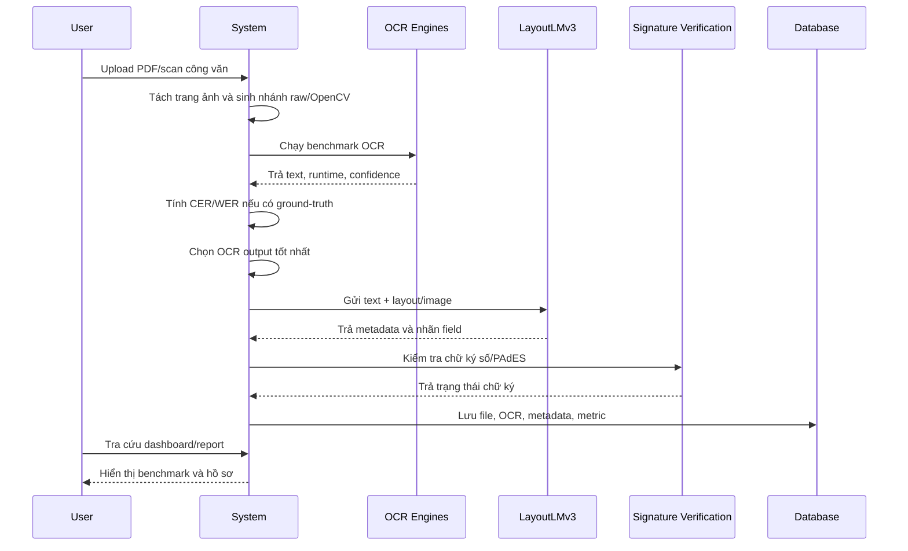

## 15. Tích hợp chữ ký số

Trong kiến trúc đề tài, chữ ký số nên được đặt sau OCR và LayoutLMv3. Lý do là hệ thống cần metadata công văn để đối soát file, định danh hồ sơ và lưu kết quả kiểm tra chữ ký. Luồng phù hợp là OCR tạo text, LayoutLMv3 trích metadata, sau đó module chữ ký số kiểm tra chứng thư, thời điểm ký và tính toàn vẹn tài liệu.

## 16. Kết luận

Dựa trên dữ liệu CER/WER đã tính từ các file ground-truth trong project, **Tesseract raw là OCR production chính phù hợp nhất cho demo hiện tại**. Engine này đạt CER thấp nhất ở các hồ sơ đầy đủ đại diện, đồng thời có runtime thấp hơn đáng kể so với các engine học sâu.

**Tesseract OpenCV adaptive** có thể dùng khi dashboard cho thấy CER/WER giảm; ở job mới nhất nhánh này cải thiện nhẹ so với raw. **PaddleOCR-VL** nên dùng cho kiểm tra layout/chất lượng offline. **PaddleOCR + VietOCR** đã tốt hơn sau fine-tune ở nhánh raw, nhưng biến thể OpenCV vẫn kém hơn nên chưa nên làm production chính. **EasyOCR** phù hợp cho kiểm thử đối chiếu.

**LayoutLMv3 nên đặt ở bước hậu OCR**, sau khi đã chọn OCR output tốt nhất. Vai trò của LayoutLMv3 là trích metadata và hiểu cấu trúc công văn, không thay thế OCR. Cách kết hợp này phù hợp với đề tài “Ứng dụng OCR kết hợp chữ ký số trong quản lý công văn điện tử tiếng Việt”: OCR nhận chữ, LayoutLMv3 hiểu trường nghiệp vụ, chữ ký số xác thực tính pháp lý và DB lưu trữ phục vụ tra cứu.

## 17. Hạn chế và hướng hoàn thiện

1. Cần mở rộng tập ground-truth để giảm lệch do số lượng hồ sơ đầy đủ còn ít.
2. Cần tách rõ job thử nghiệm partial và job benchmark chuẩn trong dashboard.
3. Cần mở rộng fine-tune PaddleOCR + VietOCR bằng nhiều mẫu công văn hơn nếu muốn dùng engine này làm production.
4. Cần huấn luyện thêm LayoutLMv3 trên tập công văn gán nhãn thật để giảm phụ thuộc rule fallback.
5. Cần lưu Docker log theo từng job để bảo đảm khả năng tái lập môi trường chạy.

## 18. Phụ lục: toàn bộ job đã scan

| Job | File | Trang | Runs | OK | Có GT | Best quality | Best CER | Best WER | Ghi chú |
|---|---|---:|---:|---:|---:|---|---|---|---|
| `b900fed40965` | 39-bgddt.pdf | 7 | 8 | 8 | Có | tesseract / raw 95.84 | tesseract / raw 3.01% | paddleocr_vl / raw 5.56% | đầy đủ |
| `2bbba632396d` | 39-bgddt.pdf | 7 | 8 | 8 | Có | tesseract / opencv_preprocessed 96.35 | tesseract / opencv_preprocessed 2.54% | paddleocr_vl / raw 5.56% | đầy đủ |
| `4eb0cda1c107` | 151_2026_ND-CP_13052026_1-signed.pdf | 38 | 8 | 8 | Có | tesseract / raw 97.26 | tesseract / raw 1.57% | paddleocr_vl / raw 3.64% | đầy đủ |
| `c2ff930c08f7` | nguyenthikimngan_QClientichbanhanh_from_word.pdf | 9 | 2 | 2 | Không | tesseract / raw 97.87 | N/A N/A% | N/A N/A% | lịch sử/partial |
| `1ed72c483235` | Thông tư 11-2026-TT-NHNN.pdf | 36 | 1 | 1 | Không | tesseract / opencv_preprocessed 97.13 | N/A N/A% | N/A N/A% | lịch sử/partial |
| `0200ba6304d0` | Thông tư 11-2026-TT-NHNN.pdf | 36 | 8 | 8 | Có | tesseract / raw 83.06 | tesseract / raw 15.02% | paddleocr_vl / raw 18.27% | đầy đủ |
| `f6da2610ebf1` | Thông tư 11-2026-TT-NHNN.pdf | 36 | 1 | 1 | Không | tesseract / opencv_preprocessed 97.13 | N/A N/A% | N/A N/A% | lịch sử/partial |
| `1b2be67c3887` | Thông tư 11-2026-TT-NHNN.pdf | N/A | 8 | 8 | Có | paddleocr_vl / opencv_preprocessed 68.63 | paddleocr_vl / opencv_preprocessed 29.20% | paddleocr_vl / opencv_preprocessed 35.40% | lịch sử/partial |
| `29a6ff9432e7` | Thông tư 11-2026-TT-NHNN.pdf | N/A | 8 | 6 | Có | easyocr / raw 62.73 | paddle_vietocr / raw 32.53% | tesseract / raw 41.81% | lịch sử/partial |
| `d704e3a52d57` | Thông tư 11-2026-TT-NHNN.pdf | N/A | 8 | 6 | Có | easyocr / raw 62.73 | easyocr / raw 34.69% | paddle_vietocr / raw 41.68% | lịch sử/partial |
| `5272abe89271` | Thông tư 11-2026-TT-NHNN.pdf | N/A | 8 | 8 | Có | paddleocr_vl / opencv_preprocessed 68.54 | paddleocr_vl / opencv_preprocessed 29.34% | paddle_vietocr / raw 33.01% | lịch sử/partial |
| `570fc6dc673c` | Thông tư 11-2026-TT-NHNN.pdf | N/A | 10 | 8 | Có | paddleocr_vl / opencv_preprocessed 68.54 | paddleocr_vl / opencv_preprocessed 29.34% | paddle_vietocr / raw 33.01% | lịch sử/partial |
| `f263c8877f78` | Thông tư 11-2026-TT-NHNN.pdf | N/A | 10 | 8 | Có | paddleocr_vl / opencv_preprocessed 68.54 | paddleocr_vl / opencv_preprocessed 29.34% | paddle_vietocr / raw 33.01% | lịch sử/partial |
| `a0ca12884c68` | Thông tư 11-2026-TT-NHNN.pdf | N/A | 2 | 2 | Không | tesseract / opencv_preprocessed 93.90 | N/A N/A% | N/A N/A% | lịch sử/partial |
| `e1eff61002aa` | Thông tư 11-2026-TT-NHNN.pdf | N/A | 10 | 4 | Có | tesseract / raw 62.25 | tesseract / raw 34.87% | paddle_vietocr / raw 41.13% | lịch sử/partial |
| `dd17e0520998` | Thông tư 11-2026-TT-NHNN.pdf | N/A | 10 | 6 | Có | paddleocr_vl / opencv_preprocessed 68.54 | paddleocr_vl / opencv_preprocessed 29.34% | paddle_vietocr / raw 33.01% | lịch sử/partial |
| `cb04ccd30a94` | Thông tư 11-2026-TT-NHNN.pdf | N/A | 10 | 4 | Có | tesseract / raw 62.25 | tesseract / raw 34.87% | paddle_vietocr / raw 41.13% | lịch sử/partial |
| `bea57eaa33ea` | sample_cong_van_scan.png | N/A | 1 | 1 | Không | easyocr / opencv_preprocessed 90.82 | N/A N/A% | N/A N/A% | lịch sử/partial |
| `92189c246949` | Thông tư 11-2026-TT-NHNN.pdf | N/A | 10 | 4 | Có | tesseract / raw 62.25 | tesseract / raw 34.87% | paddle_vietocr / raw 41.13% | lịch sử/partial |
| `84c5b1ad34dd` | Thông tư 11-2026-TT-NHNN.pdf | N/A | 2 | 2 | Có | tesseract / opencv_preprocessed 0.41 | tesseract / opencv_preprocessed 99.37% | tesseract / raw 100.00% | lịch sử/partial |
| `683cdeed1cf7` | sample_cong_van_scan.png | N/A | 1 | 1 | Không | easyocr / opencv_preprocessed 90.82 | N/A N/A% | N/A N/A% | lịch sử/partial |
| `49cae214d47b` | Nghị định số 2-ND Ấn định tiền phụ cấp cho các công nhân bị thải hồi.pdf | N/A | 10 | 4 | Có | tesseract / raw 0.87 | tesseract / raw 98.66% | tesseract / raw 100.00% | lịch sử/partial |
| `3b198ee77c6b` | Thông tư 11-2026-TT-NHNN.pdf | N/A | 10 | 4 | Có | tesseract / raw 62.25 | tesseract / raw 34.87% | paddle_vietocr / raw 41.13% | lịch sử/partial |
| `1e093db72887` | Thông tư 11-2026-TT-NHNN.pdf | N/A | 2 | 2 | Có | tesseract / raw 62.08 | tesseract / raw 34.92% | tesseract / raw 43.50% | lịch sử/partial |
| `164833c37c69` | Thông tư 11-2026-TT-NHNN.pdf | N/A | 2 | 2 | Có | tesseract / raw 62.08 | tesseract / raw 34.92% | tesseract / raw 43.50% | lịch sử/partial |
| `127e63f15dc7` | Thông tư 11-2026-TT-NHNN.pdf | N/A | 2 | 2 | Có | tesseract / raw 62.08 | tesseract / raw 34.92% | tesseract / raw 43.50% | lịch sử/partial |
